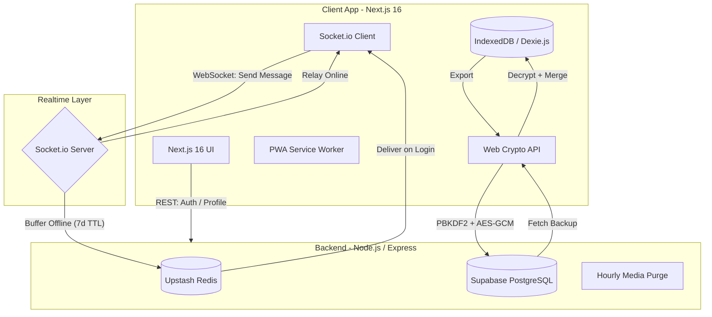

# Chapp — Privacy-First Realtime Messaging

Chapp is a sleek, modern, privacy-focused messaging app built around a **zero-server message storage philosophy**. All conversations are stored locally in the browser's IndexedDB — the server never sees your plaintext messages.

---

## System Architecture



---

## Tech Stack

### Frontend
| Layer | Technology |
|---|---|
| Framework | Next.js 16 (App Router) |
| Local DB | Dexie.js (IndexedDB) |
| Crypto | Web Crypto API (SubtleCrypto) |
| Realtime | Socket.io-client |
| Styling | Vanilla CSS + Tailwind CSS v4 |
| Icons | Lucide React |
| PWA | Service Workers + Web App Manifest |

### Backend
| Layer | Technology |
|---|---|
| Runtime | Node.js + Express |
| Realtime | Socket.io |
| Database | Supabase (PostgreSQL via Prisma) |
| Cache / Queue | Upstash Redis (offline message buffer) |
| Media | Cloudinary (auto-purged after 1h) |
| Auth | JWT (jsonwebtoken) + bcrypt |
| Push Notifications | Web Push (VAPID) |

### Infrastructure
| Service | Provider | Tier |
|---|---|---|
| Frontend | Vercel | Free |
| Backend | Render | Free |
| Database | Supabase | Free |
| Media CDN | Cloudinary | Free |
| Cache | Upstash Redis | Free |

---

## Features

### 💬 Messaging
- **End-to-End Encrypted (E2EE)** — ECDH key exchange + AES-GCM per conversation
- **Local-first storage** — messages live in IndexedDB, never persisted on server
- **Offline message queue** — messages buffered in Redis, delivered on reconnect (7-day TTL)
- **Read receipts** — single tick (sent) → single tick (delivered) → double tick (read)
- **Media sharing** — images, videos, files via Cloudinary (auto-purged after 1 hour)
- **WhatsApp-style reply** — swipe right on any message to reply with quoted preview
- **Emoji reactions** — 8 emoji reactions per message, real-time sync to other user
- **Typing indicators** — live typing status
- **Message unsend** — delete for both sides in real-time

### 👤 Profiles
- **Avatar upload** — via Cloudinary
- **Banner image** — click banner to upload/replace
- **Bio** — short personal description
- **Social links** — Instagram, Facebook, YouTube, X/Twitter, LinkedIn, GitHub, TikTok, Snapchat, WhatsApp, Phone (all optional, show as tappable icons)
- **User profile modal** — click any avatar/username to view their profile with Message + Add Friend actions

### 👥 Friends & Social
- **Friend requests** — send, accept, decline
- **Discover users** — search by username
- **Online presence** — real-time online/offline status
- **Friends tab** — live search, quick message/add actions

### 🔒 Privacy & Security
- **Zero knowledge backup** — chats encrypted client-side (PBKDF2 + AES-GCM + deflate compression) before upload; server stores only ciphertext
- **No plaintext on server** — ever
- **Password-protected restore** — passphrase never leaves the device

### 📱 Mobile
- **PWA installable** — "Add to Home Screen" for app-like experience
- **Swipe to reply** — swipe right on message triggers reply with spring-back animation
- **Long-press action sheet** — bottom sheet with emoji reactions, reply, and delete
- **Push notifications** — Web Push for offline messages

### 📞 Voice Calls
- **P2P WebRTC voice calls** — direct peer-to-peer, no server relay
- **Mute / Speaker toggle**
- **Call duration timer**

---

## Project Structure

```
chapp/
├── client/                  # Next.js 16 frontend (Vercel)
│   ├── src/
│   │   ├── app/
│   │   │   ├── chat/        # Main chat page (~4000 lines, core UI)
│   │   │   ├── login/
│   │   │   ├── signup/
│   │   │   └── forgot-password/
│   │   ├── context/
│   │   │   └── SocketContext.js   # Socket, E2EE, IndexedDB logic
│   │   └── lib/
│   │       └── crypto.js          # PBKDF2/AES-GCM backup encryption
│   └── public/
│       └── sw.js            # Service Worker (PWA + push)
│
└── server/                  # Express + Socket.io backend (Render)
    ├── src/
    │   └── server.js        # All REST + Socket.io handlers (~1400 lines)
    └── prisma/
        └── schema.prisma    # PostgreSQL schema
```

---

## Database Schema (Prisma)

```prisma
model User {
  id               String   @id @default(uuid())
  username         String   @unique
  email            String   @unique
  passwordHash     String
  avatarUrl        String?
  bannerUrl        String?
  bio              String?
  socialLinks      Json?    // { instagram, facebook, youtube, twitter, ... }
  publicKey        String?  // ECDH public key for E2EE
  encryptedPrivKey String?  // Private key encrypted with user password
  pushSubscription String?  // Web Push subscription object
  backupData       String?  // Encrypted backup ciphertext
  createdAt        DateTime @default(now())
  friendships      Friendship[]
}

model Friendship {
  id         String   @id @default(uuid())
  userId     String
  friendId   String
  status     String   // "pending" | "accepted"
  createdAt  DateTime @default(now())
  user       User     @relation(...)
}
```

---

## Local Setup

### Prerequisites
- Node.js 18+
- A Supabase project (PostgreSQL)
- An Upstash Redis database
- A Cloudinary account
- A Render account (or any Node host)

### Server

```bash
cd server
npm install

# Create .env
DATABASE_URL=postgresql://...
REDIS_URL=rediss://...
JWT_SECRET=your_secret
CLOUDINARY_CLOUD_NAME=...
CLOUDINARY_API_KEY=...
CLOUDINARY_API_SECRET=...
VAPID_PUBLIC_KEY=...
VAPID_PRIVATE_KEY=...

npx prisma migrate deploy
npm start
```

### Client

```bash
cd client
npm install

# Create .env.local
NEXT_PUBLIC_BACKEND_URL=https://your-render-service.onrender.com

npm run dev
```

---

## Backup System

Chapp's backup is fully zero-knowledge:

1. **Export** — all IndexedDB messages serialized to JSON
2. **Compress** — deflate-raw via browser-native `CompressionStream` (~70% size reduction)
3. **Encrypt** — PBKDF2 key derivation (100,000 iterations, SHA-256) + AES-GCM 256-bit encryption
4. **Upload** — encrypted ciphertext stored in Supabase under the user's row
5. **Restore** — download ciphertext → decrypt with passphrase → decompress → merge into IndexedDB

The server stores only the ciphertext string. Without the passphrase, it is computationally infeasible to recover the data.

---

## Capacity (Free Tier)

| Service | Limit | At 500 users |
|---|---|---|
| Supabase DB | 500 MB | ~75 MB ✅ |
| Render RAM | 512 MB | ~50-100 concurrent ✅ |
| Cloudinary | 1 GB storage | ~250-500 MB ✅ |
| Vercel | 100 GB/month | Not a concern ✅ |

---

## License

MIT
